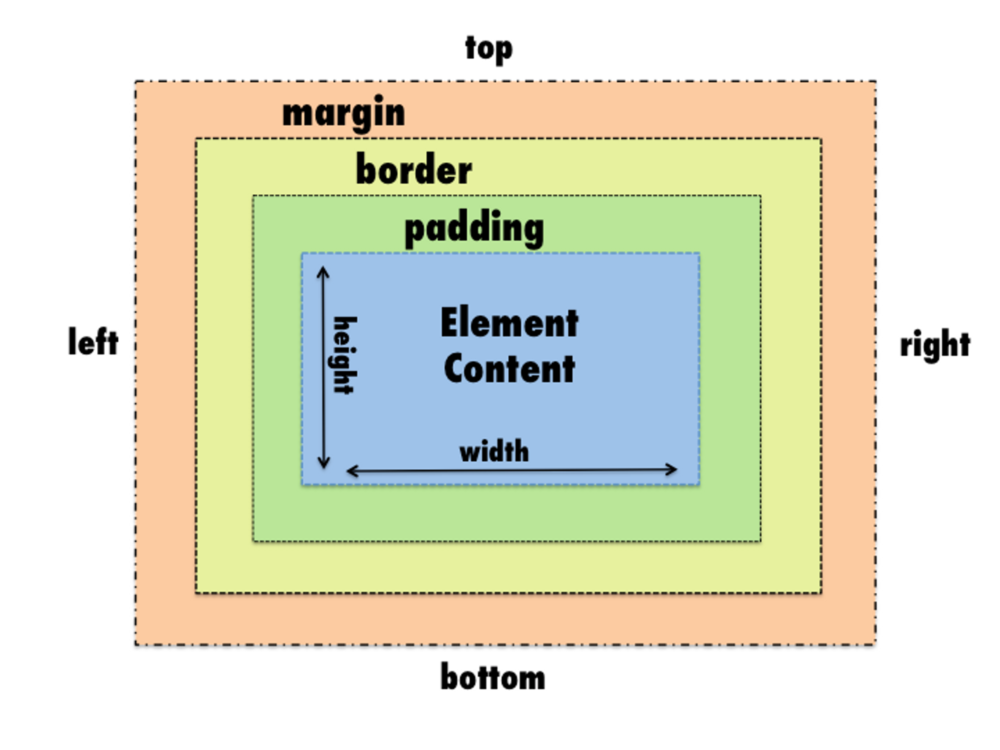

# 1. Summary

- [1. Summary](#1-summary)
- [2. Notes](#2-notes)
- [3. HTML](#3-html)
  - [3.1. What is HTML?](#31-what-is-html)
    - [3.1.1. Hypertext](#311-hypertext)
    - [3.1.2. Markup](#312-markup)
  - [3.2. Tag syntax](#32-tag-syntax)
  - [3.3. Atributes](#33-atributes)
  - [3.4. SVG](#34-svg)
- [4. CSS](#4-css)
  - [4.1. What is CSS?](#41-what-is-css)
  - [4.2. Declarations](#42-declarations)
  - [4.3. Specificity](#43-specificity)
  - [4.4. Box Model](#44-box-model)

---

# 2. Notes

Here we're going to develop a web application to manage habits and daily activities

---

# 3. HTML

Hypertext Makerup Language

HTML receive this name because of the linking utility to redirect to other pages.

## 3.1. What is HTML?

HTML is used to create text structures, links, images, videos and other page elements.

### 3.1.1. Hypertext

Hypertext refers to texts that contém links. Which mean that they can relate elements from different places.

### 3.1.2. Markup

Markup refers to the tags that'll identify those different elements which will be related to each other.

## 3.2. Tag syntax

Tags are written elements used to serve a specific purpose. For example: images, large texts, link, paragraph and so on...

- How to write HTML tags?

```html
<p>Conteúdo</p>
<!-- Here's a comment -->
```

## 3.3. Atributes

Atributes give the configuration and/or information needed from those tags.

- How to write atributes?

```html
<a href="https://rocketseat.com.br">See page</a> 
```

**HTML Example:**

```html
<h1>Titles</h1>

<p>Paragraf outside the title</p>

<a href="https://google.com" target="_blank">Link</a>
```

We can use emmet to call the basic HTML elements by typing !

```html
<!DOCTYPE html>
<html lang="en">
  <head>
    <meta charset="UTF-8" />
    <meta http-equiv="X-UA-Compatible" content="IE=edge" />
    <meta name="viewport" content="width=device-width, initial-scale=1.0" />
    <title>Document</title>
  </head>
  <body></body>
</html>
```

- All HTML configuration properties are added inside the head division, for example this meta tags informing all necessary configuration for the HTML to run properly.

- All visible information that will be displayed inside the page are added inside the body division

## 3.4. SVG

Is a kind of html used here to import our body element's properties from Figma.

# 4. CSS

Cascading Style Sheets

## 4.1. What is CSS?

CSS refers to all the style implemented to the HTML. It follows a cascading order, which means that all components and properties will consider the last element (unless there are elements of greater calculated value within the list).

## 4.2. Declarations

Declarations dictates which properties and values should be applied to defined HTML element. They declarations that contain properties and values. In order to work they expect a selector that identify where they'll be applied.

**Example:**

```css
body {
  background-color: #09090a;
  /* color: white; This will be ignored */
}

h1 {
  color: blue;
}
```

Obs.: To use hexadecimal color we need to use # before the identificator.

## 4.3. Specificity

Each selector have a score which adds to each other.

While applying the style CSS cascating order will first consider those selector's score to define which declaration should have priority.

**Obs.:** it's important to note that this score will be consider prior to the standard cascating priority order. Other example of ways to break cascating is the !import statement which, for instance, also ignore score as well.

**Selector score examples:**

```css
#id {
  /* peso 100 */
}
```

```css
.class {
  /* peso 10 */
}
```

```css
element {
  /* peso 1 */
}
```

## 4.4. Box Model

CSS logic is that everything is a box. This means that all HTML elements will be considered boxes that'll have they're own properties (content, width, height, border, padding - inner space, spacing - outer space).


